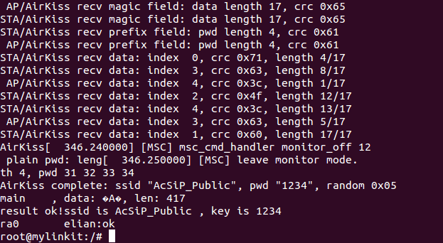
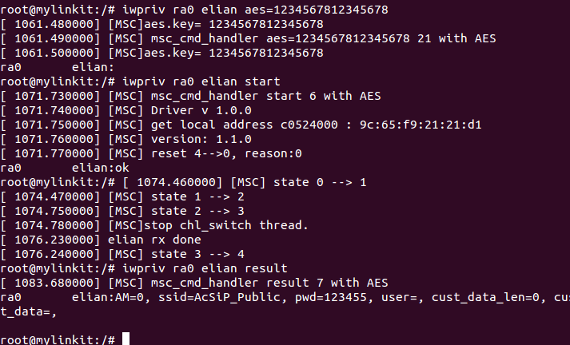
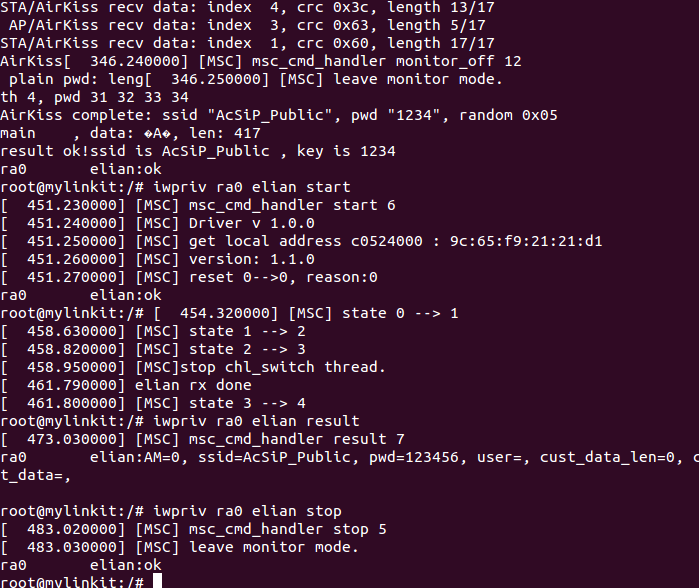

# How to use airkiss?
1. Build the airkiss package
    ```
    cp -rf package/airkiss ~/your-openwrt/package/.
    make menuconfig
    ```
    * Select the options as below:
        * Ralink SDK EASE: `airkiss`
    
    ```
    make
    ```
    
2. Start it by
    ```
    airkiss
    ```
<<<<<<< HEAD
    
# How to use elian with aes? (under xxx_elianaes.ko_xxx driver file name)
=======



# How to use elian with aes?
>>>>>>> ls-0.9.4
1. Set aes 128 encryption first. As below, "1234567812345678" just is aes.
    ```
    iwpriv apcli0 elian aes=1234567812345678 
    ```

2. Start it in 2.4GHz
    ```
    iwpriv apcli0 elian start
    ```
3. Stop it
    ```
    iwpriv apcli0 elian stop
    ```

4. Get result 
    ```
    iwpriv apcli0 elian result
    ```

5. Clear result and try to start/parse the data again
    ```
    iwpriv apcli0 elian clear
    ```
    


<<<<<<< HEAD
# How to use elian? (under xxx_elianxxx.ko_xxx driver file name) 
=======
# How to use elian? 
>>>>>>> ls-0.9.4
1. Start it in 2.4GHz
    ```
    iwpriv apcli0 elian start
    ```

2. Stop it
    ```
    iwpriv apcli0 elian stop
    ```

<<<<<<< HEAD
3. Get result 
=======
3. Get result
>>>>>>> ls-0.9.4
    ```
    iwpriv apcli0 elian result
    ```

4. Clear result and try to start/parse the data again
    ```
    iwpriv apcli0 elian clear
    ```


# linkit-smart-EK-7688AMx-feed
This one fork of linkit-smart-feed's source.

You can just change one step from 4 on Steps to 4+ here.
 
4+. Add the LinkIt Smart EK 7688AMx feed:   
    ```
    $ echo src-git linkit https://github.com/NuxNuxLi/linkit-smart-EK-7688AMx-feed.git >> feeds.conf   
    ```
Next, you can follow the howto to hang out with elian and airkiss. 

# linkit-smart-EK-7688AMx-feed
This one fork of linkit-smart-feed's source.

You can just change one step from 4 on Steps to 4+ here.
 
4+. Add the LinkIt Smart EK 7688AMx feed (support mt_wifi_elian.ko_3.18.36x):   
    ```
    $ echo src-git linkit https://github.com/NuxNuxLi/linkit-smart-EK-7688AMx-feed.git >> feeds.conf   
    ```
Next, you can follow the howto to hang out with elian and airkiss. 
# linkit-smart-feed
This feeds holds the SDK wifi driver and the config/meta package for the LinkIt Smart 7688 (Duo)

**Note**: LinkIt Smart 7688 uses the MediaTek proprietary Wi-Fi driver. While OpenWrt Chaos Calmer is evolving, only selected Linux kernel versions of it are supported by the Wi-Fi driver (3.18.21 ~ 3.18.44). If you are looking for a non-proprietary Wi-Fi driver, the [mt76](https://github.com/openwrt/mt76) project would be a reference of the choice.

# Build the firmware from sources

This section describes how to build the firmware for LinkIt Smart 7688 and LinkIt Smart 7688 Duo from source codes.


### Host environment
The following operations are performed under a Ubuntu LTS 14.04.3 environment. For a Windows or a Mac OS X host computer, you can install a VM for having the same environment:
* Download Ubuntu 14.04.3 LTS image from [http://www.ubuntu.com](http://www.ubuntu.com)
* Install this image with VirtualBox (http://virtualbox.org) on the host machine. 50GB disk space reserved for the VM is recommanded


### Steps
In the Ubuntu system, open the *Terminal* application and type the following commands:

1. Install prerequisite packages for building the firmware:
    ```
    $ sudo apt-get install git g++ make libncurses5-dev subversion libssl-dev gawk libxml-parser-perl unzip wget python xz-utils
    ```

2. Download OpenWrt CC source codes:
    ```
    $ git clone git://git.openwrt.org/15.05/openwrt.git
    ```
    
3. Prepare the default configuration file for feeds:
    ```
    $ cd openwrt
    $ cp feeds.conf.default feeds.conf
    ```
    
4. Add the LinkIt Smart 7688 feed:
    
    ```
    $ echo src-git linkit https://github.com/MediaTek-Labs/linkit-smart-7688-feed.git >> feeds.conf
    ```
5. Update the feed information of all available packages for building the firmware:
    
    ```
    $ ./scripts/feeds update
    ```
6. Install all packages:
    
    ```
    $ ./scripts/feeds install -a
    ```
7. Prepare the kernel configuration to inform OpenWrt that we want to build an firmware for LinkIt Smart 7688:
    
    ```
    $ make menuconfig
    ```
    * Select the options as below:
        * Target System: `Ralink RT288x/RT3xxx`
        * Subtarget: `MT7688 based boards`
        * Target Profile: `LinkIt7688`
    * Save and exit (**use the deafult config file name without changing it**)
8. Start the compilation process:
    
    ```
    $ make V=99
    ```
9. After the build process completes, the resulted firmware file will be under `bin/ramips/openwrt-ramips-mt7688-LinkIt7688-squashfs-sysupgrade.bin`. Depending on the H/W resources of the host environment, the build process may **take more than 2 hours**.

10. You can use this file to do the firmware upgrade through the Web UI. Or rename it to `lks7688.img` for upgrading through a USB drive.

